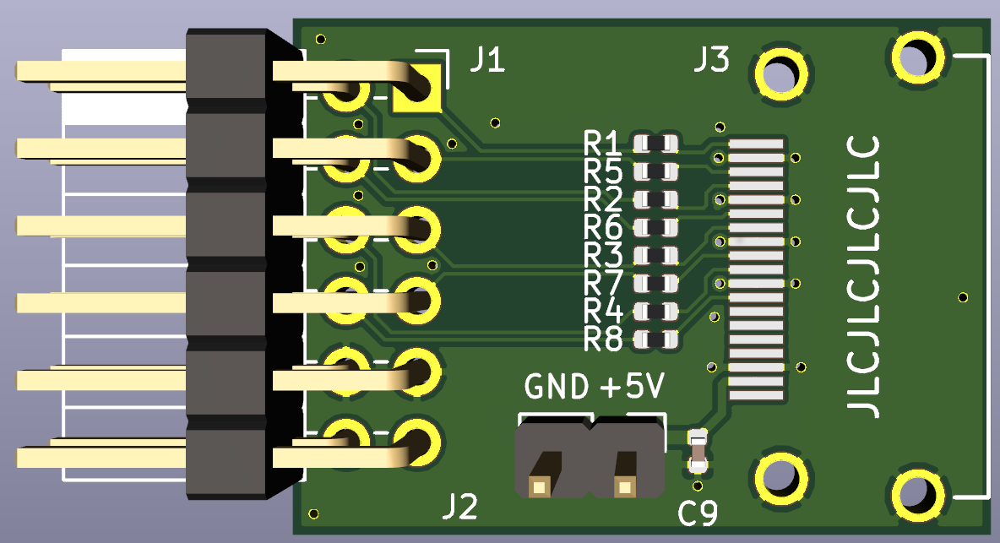

DVI PMOD
--------

This quick and dirty board adapts an HDMI A connector to a 12-pin PMOD expansion port, as found on many FPGA boards. The clock and data lanes are connected to PMOD IOs with 270-ohm series resistors, which gets close to correct CML logic levels from a 3.3V FPGA IO. This is suitable for *DVI* driven from an FPGA, but nominally not enough for HDMI, as the display data channel is not connected. A couple of people have asked me about this board on Twitter, so here are the design files -- go make some!

[PDF schematic here](dvi_pmod.pdf)

I had some of these boards made by JLCPCB (2 layers), and have tried them at up to 372 Mbps (720p 30Hz reduced blanking) on iCEBreaker and iCEstick boards.

Bill of materials:
------------------

* 8x 0402 resistors 270 ohm
* 1x 2.54 mm pin header, 2 ranks of 6 contacts, right-angle
* 1x Stewart SS-53000 HDMI A connector ([Digikey link](https://www.digikey.co.uk/product-detail/en/stewart-connector/SS-53000-001/380-SS-53000-001-ND/10492172))
* Optional 2.54 mm 2 pin header and 0402 capacitor if you need to supply +5V to the Sink

Note that the mechanical drawing provided by Stewart is actually slightly wrong, and shows the contacts offset from the centreline in the wrong direction. The batch of boards I made had this issue, and it was no big deal, just bend the lugs on the HDMI connector to get the contacts to line up with the PCB lands. The version of the board hosted in this repo has a corrected footprint.
